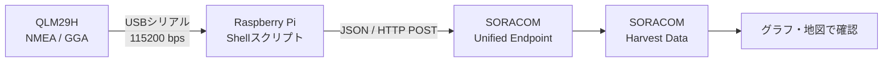

# QLM29H × SORACOM Harvest Data ハンズオン

Quectel QLM29Hが出力する測位データをRaspberry Piで受信し、JSONへ変換してSORACOM Harvest Dataへ送信するまでを体験する、初学者向けのハンズオン教材です。

完成済みのShellスクリプトを順番に実行しながら、IoTゲートウェイの基本的なデータフローを確認します。Python、`jq`、追加のプログラミング言語環境は使いません。

## このハンズオンでできるようになること

- Raspberry PiからHTTP POSTでJSONを送信できる
- USBシリアルを流れるNMEAセンテンスを観察できる
- GGAセンテンスから緯度、経度、測位品質などを読み取れる
- NMEAの度分表記を十進数度へ変換できる
- 測位データをHarvest Dataの地図で確認できる
- 回線断や再起動を考慮した再送設計の基本を説明できる
- Unified Endpointを変えずにAWSへ転送する応用構成を説明できる

## 全体構成



QLM29HへRTCM補正データを届けるNTRIP接続は事前に準備されているものとします。この教材では、補正後の測位結果に含まれる`quality=4`（Fixed RTK）または`quality=5`（Float RTK）を観察します。

## 対象者

- LinuxやRaspberry Piを初めて扱う方
- HTTP、JSON、GPS/GNSS、RTKの関係を実機で確認したい方
- IoTゲートウェイのデータ収集・変換・送信を体験したい方

Linuxのコマンド操作経験は問いません。各コマンドの目的と、確認すべき出力を[ハンズオン本文](docs/handson.md)で説明します。

## 必要なもの

- Raspberry Pi OSが動作するRaspberry Pi
- Quectel QLM29HとGNSSアンテナ
- QLM29HとRaspberry Piを接続するUSBシリアル環境
- SORACOM Air for セルラーのIoT SIMと通信環境
- SORACOMユーザーコンソールへログインできるPC
- QLM29HへRTK補正を配信できる準備済み環境

Raspberry Piから`uni.soracom.io`へ到達する通信はSORACOM Air経由である必要があります。通常のインターネット接続だけでは、このハンズオンのエンドポイントへ送信できません。

## 所要時間

休憩を含めて約4時間です。

| 時間 | 内容 |
|---:|---|
| 0:00–0:30 | 全体説明、配線、事前確認 |
| 0:30–1:15 | Harvest Data設定、ダミーデータ送信 |
| 1:15–1:25 | 休憩 |
| 1:25–2:15 | NMEA受信とGGA抽出 |
| 2:15–3:00 | 緯度経度の変換とJSON整形 |
| 3:00–3:10 | 休憩 |
| 3:10–3:40 | 1ショット送信と地図確認 |
| 3:40–4:00 | エラーハンドリング・再送設計 |

## 始め方

Raspberry Piで次のコマンドを実行します。

```bash
git clone https://github.com/takao2704/qlm29h-harvest-hands-on.git
cd qlm29h-harvest-hands-on
./scripts/00-check-environment.sh
```

問題が表示された場合は[トラブルシューティング](docs/troubleshooting.md)を参照してください。準備ができたら[ハンズオン本文](docs/handson.md)を先頭から進めます。

## スクリプト

| スクリプト | 役割 |
|---|---|
| `00-check-environment.sh` | 必須コマンド、通信経路、シリアル接続を確認 |
| `02-show-nmea.sh` | QLM29Hから届くNMEAを一定時間表示 |
| `03-show-gga.sh` | 最初のGGAセンテンスを抽出 |
| `04-format-gga.sh` | GGAをHarvest Data用JSONへ変換 |
| `05-send-position-once.sh` | 受信、抽出、変換、送信を1ショットで実行 |

スクリプトの既定値は環境変数で変更できます。

| 環境変数 | 既定値 | 説明 |
|---|---|---|
| `SERIAL_PORT` | 自動検出 | QLM29Hのシリアルポート |
| `SERIAL_BAUD` | `115200` | シリアル通信速度 |
| `SERIAL_READ_TIMEOUT` | `5` | NMEA表示・GGA待機の最大秒数 |
| `SORACOM_ENDPOINT` | `http://uni.soracom.io` | JSONの送信先 |

ポートを明示する例:

```bash
export SERIAL_PORT=/dev/serial/by-id/usb-1a86_USB_Serial-if00-port0
```

## 送信するJSON

```json
{
  "source": "qlm29h-gga",
  "lat": 35.681236,
  "lon": 139.767125,
  "quality": 4,
  "quality_label": "Fixed RTK",
  "satellites": 24,
  "hdop": 0.6,
  "altitude_m": 12.3,
  "utc_time": "03:04:05.000Z"
}
```

`lat`と`lon`はHarvest Dataの地図表示で使用するキーです。GGAには日付が含まれないため、`utc_time`は時刻のみを表します。Harvest Data上のデータ時刻には、サーバーが受信した時刻を使用します。

## サンプルデータで試す

実機や屋外測位環境が使えない場合も、同じ変換・送信手順を試せます。

```bash
./scripts/03-show-gga.sh --input samples/nmea-stream.nmea
./scripts/04-format-gga.sh --input samples/fixed-rtk.nmea
./scripts/05-send-position-once.sh --input samples/fixed-rtk.nmea
```

最後のコマンドはサンプル位置を実際にHarvest Dataへ送信します。

## テスト

テストは実機やネットワークを使用しません。Shell製の偽`curl`とサンプルNMEAで実行します。

```bash
./tests/run.sh
```

## 参考資料

- [応用: SORACOM FunnelからAWS IoT Coreを経由してJSON LinesをS3へ蓄積する](docs/funnel-iot-core-s3.md)
- [SORACOMを体験する: データを蓄積する](https://users.soracom.io/ja-jp/guides/getting-started/send-data-to-harvest-data/)
- [Uploading Data to Harvest Data](https://developers.soracom.io/en/docs/harvest/uploading-data/)
- [Unified Endpoint Configuration](https://developers.soracom.io/en/docs/unified-endpoint/configuration/)
- [QLM29H向けのNTRIP・spool付きPythonサンプル](https://github.com/takao2704/qlm29h-samples)

## 対象外

初版では次の内容を実装しません。

- NTRIP認証、RTCM受信、QLM29Hへの補正データ転送
- 連続送信やsystemdによる常駐化
- ディスクやRAMを使ったspoolと自動再送
- 英語版や講師用進行資料

エラーハンドリングと再送は[信頼性設計](docs/reliability-design.md)で設計として扱います。

## ライセンスと免責

このリポジトリは[MIT License](LICENSE)で提供します。本教材は学習用サンプルであり、商用環境での完全性、可用性、測位精度を保証するものではありません。SORACOMの利用料金、通信量、Harvest Dataの利用条件を確認して使用してください。
