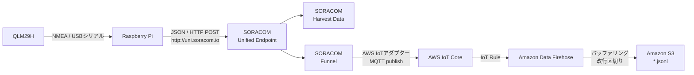

# SORACOM FunnelからAWS IoT Coreを経由してJSON LinesをS3へ蓄積する

この章では、ハンズオンで送信した測位JSONをHarvest Dataで確認しながら、同じデータをAWS IoT Coreへ転送し、Amazon S3へJSON Lines（JSONL）形式で蓄積する応用構成を説明します。

Raspberry Pi側の送信先とコマンドは変更しません。

```bash
./scripts/05-send-position-once.sh
```

このスクリプトは、これまでどおり`http://uni.soracom.io`へHTTP POSTします。SIMグループでHarvest DataとSORACOM Funnelの両方を有効にすると、Unified Endpointが同じリクエストを両サービスへ振り分けます。

## 全体構成



| サービス | 役割 |
|---|---|
| Unified Endpoint | Raspberry Piから受けた1回のPOSTをHarvest DataとFunnelへ振り分ける |
| Harvest Data | ハンズオン中のグラフ・地図確認に使用する |
| SORACOM Funnel | AWSの認証情報をRaspberry Piへ置かずにAWS IoT Coreへ転送する |
| AWS IoT Core | MQTTトピックでデータを受け、IoT Ruleで転送先を選ぶ |
| Amazon Data Firehose | 複数レコードをまとめ、改行で区切ってS3オブジェクトを作る |
| Amazon S3 | 長期保存や後続の分析に使うJSONLファイルを保管する |

## 「S3へ追記する」の考え方

一般的なS3バケットでは、ローカルファイルのように1つのファイルを開き、末尾へ1行ずつ追記する構成にはしません。Firehoseが一定量または一定時間分のレコードをバッファリングし、複数行を含む新しいS3オブジェクトを順次作成します。

```text
s3://<BUCKET_NAME>/rtk/year=2026/month=07/day=17/hour=10/<一意な名前>.jsonl
s3://<BUCKET_NAME>/rtk/year=2026/month=07/day=17/hour=11/<一意な名前>.jsonl
```

それぞれのオブジェクトの内容は、1行に1つのJSONを置くJSON Lines形式です。

```jsonl
{"operatorid":"<OPERATOR_ID>","timestamp":1784250000000,"payloads":{"source":"qlm29h-gga","lat":35.681236,"lon":139.767125,"quality":4}}
{"operatorid":"<OPERATOR_ID>","timestamp":1784250005000,"payloads":{"source":"qlm29h-gga","lat":35.681237,"lon":139.767126,"quality":4}}
```

データセット全体には新しいオブジェクトが追加されていきます。後でAmazon Athenaなどから、プレフィックス配下の複数オブジェクトをまとめて読み取れます。

> S3 Express One Zoneのディレクトリバケットにはオブジェクト追記機能がありますが、この教材では使用しません。単一AZ、追記パート数の上限、運用の複雑さがあるため、時系列データの一般的な蓄積にはFirehoseで複数オブジェクトを作る方式を採用します。

## 1. S3バケットを準備する

AWS上に保存先の汎用S3バケットを作成します。教材用であっても、次を推奨します。

- パブリックアクセスをすべてブロックする
- デフォルト暗号化を有効にする
- SORACOMの認証情報、IMSI、実際の非公開位置をバケット名やサンプルへ含めない
- 検証後に削除できるよう、教材専用のプレフィックスを使う

以降では次のプレースホルダーを使います。

| プレースホルダー | 例 |
|---|---|
| `<AWS_REGION>` | `ap-northeast-1` |
| `<AWS_ACCOUNT_ID>` | AWSアカウントID |
| `<BUCKET_NAME>` | 保存先S3バケット名 |
| `<DELIVERY_STREAM_NAME>` | Firehose配信ストリーム名 |
| `<AWS_IOT_DATA_ENDPOINT>` | AWS IoT Coreのデータエンドポイント |

## 2. Amazon Data Firehoseを設定する

Amazon Data Firehoseで、送信元を`Direct PUT`、送信先をAmazon S3とする配信ストリームを作成します。この構成ではAWS IoT RuleがFirehoseの`PutRecord`を呼び出すため、Firehose側の送信元はDirect PUTを選びます。

主な設定例:

| 設定 | 値の例 | 意味 |
|---|---|---|
| S3 bucket | `<BUCKET_NAME>` | 保存先 |
| S3 prefix | `rtk/year=!{timestamp:yyyy}/month=!{timestamp:MM}/day=!{timestamp:dd}/hour=!{timestamp:HH}/` | 時刻単位で整理する |
| File extension | `.jsonl` | JSON Linesであることを明示する |
| Compression | 無効 | 最初はS3上の内容を読みやすくする |
| Buffering | 小さめの間隔 | 演習中に結果を確認しやすくする |

Firehoseはバッファサイズまたはバッファ間隔のどちらかを満たした時点でS3へ配信します。そのため、Raspberry Piで送信に成功しても、S3オブジェクトが現れるまで少し待つ場合があります。

本構成では、改行をAWS IoT RuleのFirehoseアクションで付けます。Firehose側の改行区切り設定も使えますが、両方で付けると空行が入る可能性があるため、どちらか一方に統一します。

## 3. AWS IoT Ruleを設定する

SORACOM Funnelから受信するMQTTトピックを、IoT RuleでFirehoseへ転送します。トピックを次のように設計した場合:

```text
rtk/position/<IMSI>
```

IoT SQLの例は次のとおりです。

```sql
SELECT * FROM 'rtk/position/#'
```

ルールアクションには`Amazon Data Firehoseへメッセージを送信する`アクションを選び、次を指定します。

- 配信ストリーム: `<DELIVERY_STREAM_NAME>`
- IAMロール: AWS IoT Coreが引き受けられ、対象ストリームへ`firehose:PutRecord`できるロール
- Separator（区切り文字）: `\n`

Separatorに改行を指定することで、Firehoseがレコードを連結したときも1レコードが1行になります。実運用では、Firehoseへの転送に失敗したデータを別の宛先へ送るIoT Ruleのエラーアクションも設定します。

## 4. SORACOM Funnelを設定する

### 4-1. AWS認証情報を認証情報ストアへ登録する

AWS IoT CoreへpublishできるIAMユーザーなどの認証情報を、SORACOMの認証情報ストアへ登録します。アクセスキーをRaspberry Piの環境変数やスクリプトへ保存する必要はありません。

権限は対象トピックだけに絞ります。ポリシーの考え方は次のとおりです。

```json
{
  "Version": "2012-10-17",
  "Statement": [
    {
      "Effect": "Allow",
      "Action": "iot:Publish",
      "Resource": "arn:aws:iot:<AWS_REGION>:<AWS_ACCOUNT_ID>:topic/rtk/position/*"
    }
  ]
}
```

### 4-2. SIMグループでFunnelを有効にする

Harvest Dataを有効にした同じSIMグループで、SORACOM Funnelを有効にします。

| 設定 | 値 |
|---|---|
| 転送先サービス | `AWS IoT` |
| 転送先URL | `https://<AWS_IOT_DATA_ENDPOINT>/rtk/position/#{imsi}` |
| 認証情報 | 4-1で登録した認証情報ID |
| Content type | `JSON` |

`Content type`は必ず`JSON`を選びます。Unified EndpointへHTTP POSTしたデータは、FunnelのContent typeを指定しない場合、HTTPヘッダーにかかわらず文字列として扱われます。`JSON`を選ぶと、Funnelが付加するエンベロープの`payloads`にJSONオブジェクトとして格納されます。

FunnelがAWS IoT Coreへ送るデータは、Raspberry Piが作ったJSONそのものではなく、SORACOMの情報を付加したJSONです。概念的には次の形になります。

```json
{
  "operatorid": "<OPERATOR_ID>",
  "timestamp": 1784250000000,
  "destination": {
    "resourceUrl": "https://<AWS_IOT_DATA_ENDPOINT>/rtk/position/<IMSI>"
  },
  "payloads": {
    "source": "qlm29h-gga",
    "lat": 35.681236,
    "lon": 139.767125,
    "quality": 4
  },
  "sourceProtocol": "http",
  "imsi": "<IMSI>"
}
```

公開教材やログの共有時は、`operatorid`、`imsi`、AWSアカウントID、実際の位置をマスクしてください。

## 5. Raspberry Piから送信する

端末側の設定とコマンドは変更しません。

```bash
./scripts/05-send-position-once.sh
```

データの流れは次のようになります。

```text
Raspberry Pi
    └─ HTTP POST → Unified Endpoint
                         ├─ Harvest Dataへ保存
                         └─ Funnel → AWS IoT Core → Firehose → S3
```

Unified Endpointのレスポンス形式を有効にしている場合は、レスポンスの`SoracomHarvest`と`SoracomFunnel`それぞれのステータスを確認できます。ただし、Funnel以降の転送は非同期です。Unified EndpointへのPOSTが成功しても、S3への保存完了をその場で保証するものではありません。

## 6. 各地点で確認する

問題が起きたときは、入口から順に確認します。

1. **Harvest Data**: これまでどおりグラフや地図にデータが表示されるか
2. **Unified Endpointのレスポンス**: Harvest DataとFunnelへの受付結果が成功しているか
3. **AWS IoT Core**: MQTTテストクライアントで`rtk/position/#`を購読し、FunnelのJSONが届くか
4. **IoT Rule**: ルールの一致件数とエラーをAmazon CloudWatchで確認する
5. **Firehose**: 配信成功・失敗のメトリクスとエラーログを確認する
6. **S3**: バッファ間隔を待ち、`.jsonl`オブジェクトの各行が完全なJSONか確認する

S3へ届かない場合にRaspberry Piの送信処理から調べ直すのではなく、どこまで届いているかを1段ずつ切り分けることが重要です。

## 7. 実運用で追加する設計

SORACOM Funnelは非同期で転送します。順序の入れ替わりや重複が起こる可能性を前提にします。

- 端末側のJSONへ一意な`message_id`を追加する
- GGAには日付がないため、日付を含む測定時刻を別途組み立てる
- Funnelの`timestamp`をクラウド受信時刻として保持する
- 重複を許容するか、後段処理で`message_id`を使って除外する
- IoT Rule、Firehose、S3のエラー件数を監視する
- S3 Lifecycleで保存期間や低コストストレージへの移行を決める

このハンズオンのJSONは仕組みを観察するための最小構成なので、`message_id`の追加や連続送信は応用課題です。

## 公式資料

- [Unified Endpoint](https://developers.soracom.io/en/docs/unified-endpoint/)
- [Unified EndpointからFunnelとHarvest Dataへ送信する](https://users.soracom.io/ja-jp/docs/unified-endpoint/funnel-and-harvest/)
- [SORACOM FunnelからAWS IoT Coreへデータを送信する](https://developers.soracom.io/en/start/aws/funnel-iotcore/)
- [SORACOM Funnelの設定](https://developers.soracom.io/en/docs/funnel/configuration/)
- [SORACOM Funnelのデータ形式と注意点](https://developers.soracom.io/en/docs/funnel/)
- [AWS IoT RuleのFirehoseアクション](https://docs.aws.amazon.com/iot/latest/developerguide/kinesis-firehose-rule-action.html)
- [FirehoseからAmazon S3への配信](https://docs.aws.amazon.com/firehose/latest/dev/basic-deliver.html)
- [Firehoseが作るS3オブジェクト名](https://docs.aws.amazon.com/firehose/latest/dev/s3-object-name.html)
- [S3 Express One Zoneでオブジェクトへ追記する](https://docs.aws.amazon.com/AmazonS3/latest/userguide/directory-buckets-objects-append.html)
