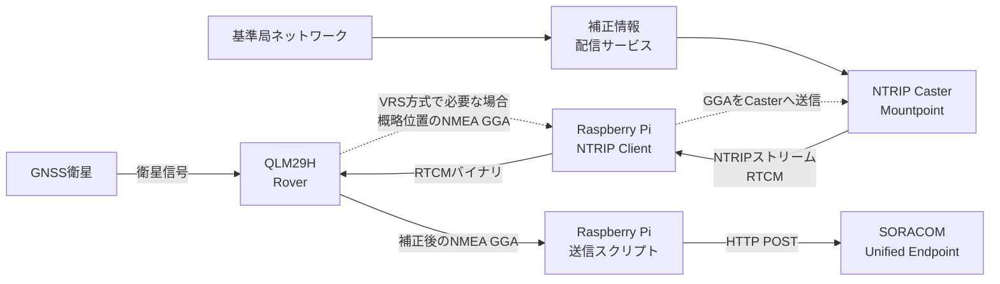

# NTRIPで配信される補正情報とRTK測位

この章では、NTRIPを使ってQLM29Hへ補正情報を届け、RTK測位を行う仕組みを説明します。

本編ではNTRIP接続とQLM29Hへの補正入力が準備済みであることを前提とします。この章も仕組みの解説だけを扱い、接続コマンド、サービス固有の設定値、認証情報は掲載しません。

## NTRIP、RTCM、RTKの関係

3つは役割が異なります。

| 用語 | 役割 |
|---|---|
| NTRIP | GNSSデータをインターネット経由でストリーミングするためのプロトコル |
| RTCM | 基準局の観測情報や補正情報を表すデータ形式 |
| RTK | Rover側の観測値と基準局側の情報を組み合わせ、高精度な位置を求める測位方式 |

このハンズオンでは、「NTRIPでRTCMデータを受信し、QLM29HがRTK測位に使用する」と整理します。NTRIP自体が位置を補正するわけではありません。

## 登場する要素

| 要素 | 説明 |
|---|---|
| 基準局 | 座標が既知の場所でGNSS信号を観測する |
| 補正情報配信サービス | 基準局ネットワークの情報から配信用データを生成する |
| NTRIP Caster | 複数の補正ストリームを配信するサーバー |
| Mountpoint | Caster上で補正ストリームを選ぶための名前 |
| NTRIP Client | Casterへ接続し、選択したストリームを受信するソフトウェア |
| Rover | 補正情報を利用して移動局側の位置を求めるGNSS受信機。この構成ではQLM29H |
| VRS | Rover付近に仮想的な基準局を作る方式。概略位置のGGA送信を要求することがある |

## 全体構成



NTRIP Casterへの接続とUnified EndpointへのHTTP POSTは、別の通信です。どちらもSORACOM Airの回線を利用できますが、接続先と目的は異なります。

## 補正が適用されるまでの流れ

1. QLM29HがGNSS衛星の信号を観測し、まず単独測位を行います。
2. Raspberry Pi上のNTRIP Clientが、Casterのホスト、ポート、Mountpoint、認証情報を使って接続します。
3. VRS方式など、位置に応じた補正を生成するサービスでは、QLM29Hの概略位置を含むNMEA GGAをCasterへ送ります。
4. CasterからRTCM形式の補正ストリームが届きます。
5. NTRIP Clientは受け取ったRTCMバイナリをQLM29Hへ渡します。
6. QLM29Hが自身の観測値と補正情報を組み合わせ、RTKの解を計算します。
7. QLM29Hが補正後の測位結果をNMEA GGAとして出力します。

補正情報は一度受信すれば終わりではありません。RTK測位を続ける間、NTRIPストリームを継続して受信し、QLM29Hへ渡し続ける必要があります。

## VRSでGGAをCasterへ送る理由

VRSでは、補正情報配信サービスがRover付近に仮想的な基準局を作ります。そのため、サービスはRoverのおおよその現在位置を必要とします。

このときNMEA GGAは、次の2方向で使われます。

```text
QLM29H → Raspberry Pi → NTRIP Caster
  概略位置を伝え、付近のVRS用補正情報を受ける

QLM29H → Raspberry Pi → Unified Endpoint
  補正後の測位結果をクラウドへ送る
```

利用するMountpointがGGA送信を必要とするかは、補正情報配信サービスの仕様で確認します。すべてのMountpointがGGAを要求するわけではありません。

GGAには位置が含まれるため、Casterへ送信される情報の取り扱いとサービスのプライバシーポリシーも確認します。

## GGAのqualityで補正状態を観察する

補正情報の受信を開始すると、代表的には次のように状態が変化します。

```text
quality=1 単独測位
    ↓ 補正情報を受信し、RTK計算を開始
quality=5 Float RTK
    ↓ 整数アンビギュイティが確定
quality=4 Fixed RTK
```

必ずこの順番で遷移するとは限りません。起動直後からFixed RTKになる場合や、電波環境や補正状態によってFloat RTKへ戻る場合もあります。

本編の`04-format-gga.sh`と`05-send-position-once.sh`は、`quality=4`と`quality=5`だけでなく、No Fix以外の有効な測位結果をJSONへ変換します。クラウド側でも`quality`と`quality_label`を使い、どの状態の位置かを区別します。

`quality=4`はRTKの整数解が得られたことを表しますが、座標が常に正しいことを単独で保証するものではありません。

## NMEAとRTCMを混同しない

Raspberry Piから見た主なデータの向きは次のとおりです。

| データ | 主な向き | 内容 |
|---|---|---|
| RTCM | NTRIP Caster → Raspberry Pi → QLM29H | RTK計算に使う補正情報 |
| NMEA GGA | QLM29H → Raspberry Pi | 測位結果 |
| NMEA GGA（VRS用） | QLM29H → Raspberry Pi → NTRIP Caster | Roverのおおよその位置 |
| JSON | Raspberry Pi → Unified Endpoint | クラウドへ保存する測位データ |

RTCMはバイナリデータです。NMEAのように端末へ表示して人が読む用途ではなく、原則として内容を変更せずQLM29Hへ渡します。

## 補正が効かないときの考え方

| 観察される状態 | 主な確認対象 |
|---|---|
| Casterへ接続できない | 回線、DNS、ホスト、ポート、TLS要否、認証情報 |
| 認証に失敗する | ユーザー名、パスワード、契約、Mountpointへのアクセス権 |
| 接続済みだがRTCMが届かない | Mountpoint名、サービス状態、GGA送信の要否 |
| `quality=1`のまま | RTCMがQLM29Hへ届いているか、RTCM形式や衛星系が受信機と合うか |
| `quality=5`から`4`にならない | アンテナ上空、遮蔽、マルチパス、基準局との距離、使用衛星数、補正の鮮度 |
| `quality=4`から頻繁に戻る | 回線断、RTCM受信の途切れ、アンテナの移動や遮蔽、補正サービスの状態 |

「NTRIPへ接続できた」ことと「QLM29Hが補正情報を使えている」ことは別です。接続状態だけでなく、RTCMの最終受信時刻、受信バイト数、補正情報の経過時間、GGAのqualityを組み合わせて判断します。

## ゲートウェイとして分離して考える

実運用では、次の2つを独立した処理として設計します。

```text
補正経路: NTRIP Caster → RTCM受信 → QLM29H
送信経路: QLM29H → NMEA受信 → JSON変換 → Unified Endpoint
```

- Harvest Dataへの送信が失敗しても、NTRIP補正は継続できるようにする
- NTRIPが切れても、NMEA受信と状態監視を続け、qualityの低下を記録する
- NTRIP再接続中にHTTP送信処理を停止させない
- RTCM受信とHTTP送信のそれぞれに、最終成功時刻とエラー理由を持たせる

本編の1ショットスクリプトは、すでに補正されたQLM29Hの出力を観察して送信する役割だけを持ちます。NTRIPの常時接続や再接続処理は実装しません。

## Pythonサンプル実装

補正経路をコードで確認する場合は、別リポジトリの[QLM29H向けPythonサンプル](https://github.com/takao2704/qlm29h-samples)を参照できます。本編で実行するShellスクリプトとは独立した、発展的な実装例です。

| サンプル | 確認できること |
|---|---|
| [`rtk_client.py`](https://github.com/takao2704/qlm29h-samples/blob/main/rtk_client.py#L145-L233) | NTRIP接続、RTCM受信、QLM29Hへの転送、GGA返送、再接続という補正経路の基本 |
| [`rtk_nmea_unified.py`](https://github.com/takao2704/qlm29h-samples/blob/main/rtk_nmea_unified.py#L431-L511) | NTRIP処理を別スレッドにし、NMEA受信やspool付きクラウド送信と分離する常駐向け構成 |
| [`docs/sequence.md`](https://github.com/takao2704/qlm29h-samples/blob/main/docs/sequence.md) | NTRIP、シリアル受信、spool、Unified Endpoint送信の並行動作 |

最初に読む場合は、補正経路だけに集中した`rtk_client.py`の`build_ntrip_request()`と`ntrip_client()`を確認します。処理の骨格は次のとおりです。

```text
NTRIP Casterへ接続する
    ↓
Mountpointを指定したリクエストと認証情報を送る
    ↓
成功レスポンスを確認する
    ↓
RTCMをバイナリのまま受信してQLM29Hのシリアルへ書く
    ↕
最新のGGAを定期的にCasterへ返す
    ↓
切断や例外が起きたら待機して再接続する
```

この処理では、ネットワークソケットから受信したRTCMのバイト列を、`serial.write()`でQLM29Hへ渡します。同時に、シリアルから読み取った最新GGAを共有し、NTRIP Casterへ定期送信します。

`rtk_nmea_unified.py`では、役割をさらに分離しています。

```text
NTRIP worker  : Caster接続、GGA返送、RTCMのシリアル転送
Main          : QLM29HからNMEAを継続受信して最新状態を更新
Unified worker: spoolの古いJSONからUnified Endpointへ送信
```

NTRIP通信、NMEA受信、HTTP送信を分けることで、クラウド送信がタイムアウトしても補正情報とNMEAの流れを止めにくくします。複数の処理が同じシリアルポートを使用するため、サンプルではロックを使って書き込みの競合も防ぎます。

Pythonは、ソケット通信、バイナリデータ、シリアル通信、スレッド、例外処理を1つのプログラムで扱いやすいため、この継続処理のサンプルに使用しています。Shellで実装できないという意味ではありませんが、本編のような観察・1ショット送信より複雑になるため、応用実装として分離しています。

サンプルは開発例です。実際に利用するときは、補正サービスが要求するNTRIPバージョン、暗号化方式、Mountpoint、RTCMメッセージ、GGA送信間隔に合わせて設計し、接続先や認証情報をコードへ直接埋め込まないようにします。

## Geospatial用途で追加確認すること

測位結果を業務で利用するときは、Fixed/Floatだけでなく次も確認します。

- 補正サービス、Mountpoint、RTCMメッセージ、対象衛星系が受信機と合っているか
- 基準局またはネットワークとRoverが使用する基準座標系・測地基準が一致しているか
- アンテナ高、アンテナ位相中心、設置姿勢をどのように座標へ反映するか
- GGAの高度とジオイド高、楕円体高の関係をどのように扱うか
- 既知点での検証、再現性、外れ値判定をどのように行うか
- 遮蔽やマルチパスが起きた区間のqualityをどのように記録・除外するか

センチメートル級という表現だけで精度を判断せず、座標系、高さ、アンテナ、補正の出所、品質指標を含めて成果を評価します。

## 認証情報と位置情報の扱い

- NTRIPのホスト、ユーザー名、パスワードをリポジトリへコミットしない
- 設定ファイルの読み取り権限を必要なプロセスだけに限定する
- 補正サービスが対応している場合は暗号化された接続を選ぶ
- ログへパスワードやAuthorizationヘッダーを出さない
- VRS用GGAによって位置がサービス事業者へ送られることを運用上明確にする
- 契約終了、端末交換、漏えい時に認証情報を失効・更新できるようにする

## 公式資料

- [RTCM Published Standards — NTRIP Version 2 / Differential GNSS](https://www.rtcm.org/rtcm-standards)
- [BKG: Ntripの概要](https://igs.bkg.bund.de/ntrip/about)
- [BKG: Networked Transport of RTCM via Internet Protocol](https://igs.bkg.bund.de/root_ftp/NTRIP/documentation/NtripDocumentation.pdf)
- [BKG Ntrip Client: VRSで使用するNMEA GGAの説明](https://acc.igs.org/misc/bnchelp_v2-8.pdf)
