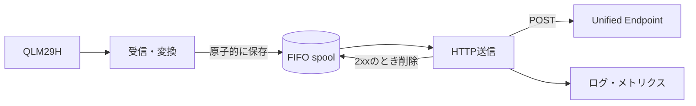

# エラーハンドリングと再送の設計

この章は設計の解説です。本リポジトリのShellスクリプトには自動再送や常駐化を実装しません。

## なぜ受信と送信を分けるのか

QLM29Hは一定間隔でNMEAを出力します。一方、HTTPの応答時間は通信状態やクラウドの状態によって変化します。

1つの処理が「シリアルを読む → HTTP応答を待つ」を順番に実行すると、HTTPが止まっている間はシリアルを読めません。そのため、実運用では収集と送信を分離します。



受信側はJSONを一時ファイルへ書き、書き込み完了後にspool内の正式な名前へ変更します。これにより、送信側が書きかけのJSONを読むことを防ぎます。

## 障害ごとの判断

| 障害 | 検出例 | その場の処理 | 自動再送 |
|---|---|---|---|
| シリアル未受信 | 一定時間GGAなし | ポート、電源、配線を記録 | 受信ポート再オープンを検討 |
| NMEA不正 | フィールド不足、数値不正 | 破棄し件数を記録 | 同じデータは再処理しない |
| No Fix | `quality=0` | 送信対象外として記録 | 測位回復後の新データを待つ |
| DNS・接続エラー | `curl`相当の接続失敗 | spoolへ残す | する |
| HTTP 400番台 | 400、401、403など | spoolを保留し設定を通知 | 原則しない |
| HTTP 429 | リクエスト過多 | spoolへ残す | 指示された待ち時間後にする |
| HTTP 500番台 | 500、502、503など | spoolへ残す | する |
| timeout | 応答前に期限超過 | spoolへ残す | するが重複の可能性あり |
| 再起動 | プロセス・OS停止 | 起動時にspoolを再走査 | 永続spoolならする |
| 容量枯渇 | 件数・バイト上限 | 決めた方針で破棄し通知 | 空きができてからする |

すべての4xxが永久エラーとは限らず、429は一時的な制限として扱います。実際の応答仕様を確認して分類します。

## 再送間隔

一時障害の直後に短い間隔で送り続けると、回線とクラウドの負荷を増やします。指数バックオフを使い、失敗するたびに待ち時間を増やします。

```text
1秒 → 2秒 → 4秒 → 8秒 → 16秒 → ... → 上限60秒
```

多数のデバイスが同時に再接続しないよう、各待ち時間へランダムな揺らぎ（jitter）を加えます。新しいデータが到着しても、古いデータを飛び越えずFIFO順を維持するかどうかは、用途の要件で決めます。

## at-least-onceと重複

HTTP POST後にtimeoutが起きた場合、次のどちらかをデバイスから区別できません。

- クラウドへ届く前に失敗した
- クラウドは保存したが、応答だけがデバイスへ戻らなかった

データを失わないために再送すると、後者では同じデータが2回保存されます。この方式をat-least-onceと呼びます。

各データへ一意な`message_id`を付け、後段で重複を判定できるようにします。例えば、デバイスID、GNSS時刻、起動ごとのランダムID、連番を組み合わせます。IDだけでなく、同じIDが再送されたときのクラウド側の扱いも設計する必要があります。

## spoolの容量

送信周期と保持したい停止時間から必要件数を見積もります。5秒に1件送る場合、1時間分は次の件数です。

```text
60分 × 60秒 ÷ 5秒 = 720件
```

1件が最大1KBなら、JSON本体だけで約720KBです。ファイルシステムの管理情報、ログ、将来の項目追加を考えて余裕を持たせます。

上限に達した場合の候補:

- 最も古いデータを捨て、新しい位置を優先する
- 新しいデータを捨て、停止前からの履歴を守る
- 送信間隔や保存間隔を一時的に広げる
- 重要度の低いフィールドを削る

どれが正しいかは、「最新位置」と「完全な軌跡」のどちらを優先するかで変わります。破棄した件数は必ず記録します。

## RAMとディスク

| 保存先 | 長所 | 短所 | 向くケース |
|---|---|---|---|
| RAM / tmpfs | 高速、SDカードへ書かない | 再起動・電源断で消える | 最新データ優先、短い回線断 |
| SDカード | 再起動後も残る | 書き込み寿命、破損リスク | 履歴を失いたくない |
| 外部ストレージ | 容量・耐久性を選べる | 機材と管理が増える | 長時間のオフライン運用 |

ディスクを使う場合も、1件ごとの同期書き込み、ログ量、ファイル数がSDカードへ与える影響を確認します。

## 観測する情報

最低限、次をログまたはメトリクスで確認できるようにします。

- 最終GGA受信時刻
- 最新のquality、衛星数、HDOP
- 最終HTTP成功時刻とステータス
- 連続失敗回数
- spoolの件数と合計バイト数
- 不正NMEA、No Fix、容量超過による破棄件数
- プロセスの再起動回数

認証情報、IMSI、詳細な位置情報を不要にログへ残さないよう注意します。

## 次の実装例

常駐化、NTRIP、複数NMEAセンテンスの構造化、spool付き送信まで確認したい場合は、[qlm29h-samplesの`rtk_nmea_unified.py`](https://github.com/takao2704/qlm29h-samples/blob/main/rtk_nmea_unified.py)を参照してください。

このハンズオンで作った1ショット処理をそのまま無限ループへ入れるのではなく、受信、保存、送信、監視を分けることが実運用化の出発点です。
